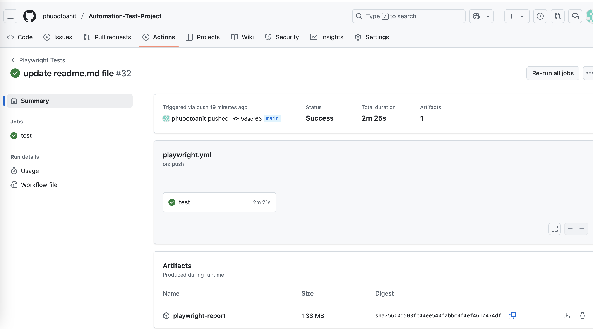

# Automation-Test-Project

## Instruction
A comprehensive test automation using Playwright with TypeScript, implementing the Page Object Model pattern for web testing.

## Table of Contents
1.  [Purpose of Framework](#1-purpose-of-framework)
2.  [Installation](#2-installation)
3.  [Framework Structure](#3-framework-structure)
4.  [Execution](#4-execution)
5.  [Test Cases Documented](#5-test-cases-documented)
6.  [CI/CD Integration Guideline](#6-ci/cd-integration-guideline)
7.  [Reporting](#7-reporting)

## 1. Purpose of Framework

  Provide a Playwright Framework for Web Application with TypeScript, implementing the Page Object Model and integrated with CI/CD Github Action

## 2. Installation

#### 1. Clone the Repository

```console
git clone https://github.com/phuoctoanit/Automation-Test-Project.git
cd your-repo-name
```

#### 2. Install Dependencies

```console
npm install
```

#### 3. Install Playwright Browser

```console
npx playwright install
```

## 3. Framework Structure
<pre>
├── apis
│   ├── BaseAPIs.ts
│   ├── EmployerApiClient.ts
│   └── LoginApiClient.ts
├── constants
│   ├── APIEndpoint.ts
│   ├── Color.ts
│   └── ExcelData.ts
├── form-data
│   └── formData.ts
├── image.png
├── mock-apis
│   ├── configs
│   │   └── config.ts
│   └── src
│       ├── app.ts
│       ├── auth
│       │   └── login.ts
│       ├── controllers
│       │   └── employer.controller.ts
│       ├── middlewares
│       │   └── auth.ts
│       ├── models
│       │   └── employer.model.ts
│       ├── routers
│       │   ├── employer.routers.ts
│       │   └── login.routers.ts
│       └── server.ts
├── package-lock.json
├── package.json
├── pages
│   ├── BasePage.ts
│   ├── HomePage.ts
│   └── PageManager.ts
├── playwright.config.ts
├── README.md
├── resources
│   ├── data-forms
│   │   └── Data.xlsx
│   └── images
│       └── cat.jpeg
├── tests
│   ├── api
│   │   └── employer-api.spec.ts
│   ├── form
│   │   ├── 00 - validations.spec.ts
│   │   ├── 01 - default-value.spec.ts
│   │   └── 02 - submission.spec.ts
│   └── shared.fixtures.ts
├── tsconfig.json
└── utils
    └── ExcelUtils.ts
</pre>
## 4. 🧪 Execution

#### 1. Start mock API

```console
npx ts-node mock-apis/src/server.ts

```
#### 2. Run All Tests

```console
npx playwright test
```

#### 3. Run Specific Test File

```console
npx playwright test tests/form/03 - validation.spec.ts
```

#### 4. Run with Tagged Tests (e.g.: @validation)

```console
npx playwright test --grep @validation
```

#### 4. Custom Environment Variables

```console
BROWSER=firefox npx playwright test
```

#### 4. Open Playwright Test Runner (UI Mode)

```console
npx playwright test --ui
```

## 5. Test Cases Documented

Using this [form](https://demoqa.com/automation-practice-form) to write some test cases as belows:

### 🧪 Test Case Summary

| TC ID  | Title                              | Status   |
|--------|------------------------------------|----------|
| TC001  | Validate gender, hobbies and date of birth values on form            | ✅ Pass  |
| TC002  | User can submit data to form with all valid data           | ✅ Pass  |
| TC003  | User can submit data to from with required field data    | ✅ Pass  |
| TC004  | Validation if user leave empty, space or specific characters on First Name   | ❌ Fail  |
| TC005  | Validation if user leave empty, space or specific characters on Last Name    | ❌ Fail  |
| TC006  | Validation if user leave empty, invalid email formmat    | ✅ Pass  |
| TC007  | Validation if user leave empty, characters, less than 10 digits or more than 10 digits on Phone Number   | ✅ Pass  |
| TC008  | Validation if user doesn't select on Gender    | ✅ Pass  |
| TC009  | Validation if user doesn't select on Hobbies    | ✅ Pass  |
| TC010  | Validation if user leave empty value on Subject    | ❌ Fail  |
| TC011  | Validation if user can de-select all or de-select one by one on Subject    | ❌ Fail  |
| TC012  | Validation if user leave empty value or enter a long text on Current Address   | ✅ Pass  |
| TC013  | Validation if user submit form with all empty data   | ❌ Fail  |

## 6. CI/CD Integration Guideline

<p>The CI/CD pipeline, configured with GitHub Actions, triggers on every push to the main branch.</p>

<p>GitHub workflow file: .github/workflows/playwright.yml</p>

<p>Playwright reports are generated and published via GitHub Pages.</p>

### 📘 GitHub Actions Workflow

#### 🧱 Trigger the the workflow
- On **push** to the main branch
- On **pull** request the the main branch
    
```console
on:
    push:
        branches: [ main ]
    pull_request:
        branches: [ main ]
```
    

#### 🔧 Set Environment Variables
Sets the BROWSER environment variable

```console
env:
  BROWSER: chromium

```

### ✅ Job Steps Breakdown
#### 1. ⬇️ Checkout Code

```console
- name: ⬇️ Checkout code
  uses: actions/checkout@v3
```

#### 2. 🟢 Setup Node.js

```console
- name: 🟢 Setup Node.js
  uses: actions/setup-node@v3
  with:
    node-version: 20
```

#### 3. 📦 Install Dependencies

```console
- name: 📦 Install dependencies
  run: npm ci
```

#### 4. 🧱 Install Playwright Browsers

```console
- name: 🧱 Install Playwright browsers
  run: npx playwright install --with-deps
```

#### 5. ▶️ Run Playwright Tests

```console
- name: ▶️ Run Playwright tests
  run: |
    echo "Running Playwright tests..."
    npx playwright test || true
    echo "Playwright tests completed."
```

#### 6. 📝 Check if Report Exists

```console
- name: 📝 Check if Playwright report exists
  if: always()
  run: |
    echo "Checking for Playwright report..."
    if [ -d playwright-report ]; then
      echo "✅ Report exists."
    else
      echo "❌ Report directory not found!"
    fi
```
#### 7. 📤 Upload Test Report

```console
- name: 📤 Upload Playwright report
  if: always()
  uses: actions/upload-artifact@v4
  with:
    name: playwright-report
    path: playwright-report
    if-no-files-found: warn
```

## 7. 🧾 Reporting

#### 1. After a test run, view the report using:

```console
npx playwright show-report
```

#### 2. On Github Action, download the lasted running.



